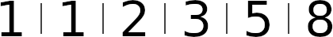
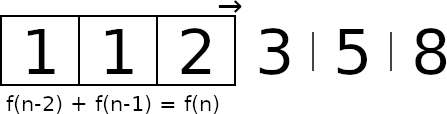

In this project, I'll demonstrate the Sliding Window approach. It's a technique
in algorithm design that I think is pretty neat.

Some time ago, I found a problem that essentially boiled down to the following
assumptions and questions.

1) Any pair of adult rabbits gives birth to a litter of eight new rabbits (four female and four male) each month.
2) Rabbits become adult when they turn five months old.

Starting with just one pair of adult rabbits, what's the number of
a) rabbits; and
b) adult rabbits;
after 24 months?

When I've introduced this problem to other developers, many have been inclined
to attempt to solve it analytically. While amiable, this seldom turned out well
(in terms of velocity, at least) and sometimes hindered them from considering
alternative solutions.

# Fundamental idea

Picture a long strip of paper. At regular intervals, vertical lines split it
into cells, each containing a number. As an example, Fig. 1 illustrates the
beginning of the Fibonacci sequence.

This strip, we thread through a bit of plastic that accentuates a handful of
cells. We'll refer to this as our "window". Notice how, in Fig. 2, the window
can be used to inform the next number in the sequence. Hence, we can generate
the number for an arbitrary position simply by continuing to slide the window
and fill out blank cells.

That is, we've found a simple, numerical way to calculate some Fibonacci
number, without the need to introduce e.g., recursion.

# Solution

So far, we've explained the idea behind the Sliding Window approach. Next, let
us apply it to our original problem.
