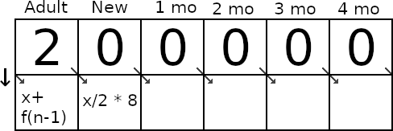

In this project, I'll demonstrate the Sliding Window approach. It's a technique
in algorithm design that I think is pretty neat.

Some time ago, I found a problem that essentially boiled down to the following
assumptions and questions.

1) Any pair of adult rabbits gives birth to a litter of eight new rabbits (four female and four male) each month.
2) Rabbits become adult when they turn five months old.

Starting with just one pair of adult rabbits, what's the number of
a) rabbits; and
b) adult rabbits;
after 24 months?

When I've introduced this problem to other developers, many have been inclined
to attempt to solve it analytically. While amiable, this seldom turned out well
(in terms of velocity, at least) and sometimes hindered them from considering
alternative solutions.

# Fundamental idea

Picture a long strip of paper. At regular intervals, vertical lines split it
into cells, each containing a number. As an example, Fig. 1 illustrates the
beginning of the Fibonacci sequence.


This strip, we thread through a bit of plastic that accentuates a handful of
cells. We'll refer to this as our "window". Notice how, in Fig. 2, the window
can be used to inform the next number in the sequence. Hence, we can generate
the number for an arbitrary position simply by continuing to slide the window
and fill out blank cells.


That is, we've found a simple, numerical way to calculate some Fibonacci
number, without the need to introduce e.g., recursion.

# Solution

So far, we've explained the idea behind the Sliding Window approach. Next, let
us apply it to our original problem.

As we can see, the rabbits will live through various stages in their life.
First, they are born. Then they age, to become one month old, then two, three
and four. After that, however, they become adults and start producing offspring
of their own.

In other words, our algorithm will be a bit more compilated than the one above:
Six changable dimensions rather than one, all of which is dependent on another.
As shown in Fig. 3, the number of adults determine the amount of newborn
rabbits, while most other dimensions just rotates by one stage. The exception
is when the four-monthers become adult (as they are an addition rather than a
replacement).



For clarity, the result at each of the first few iterations are shown in the
table below. Note in particular the exponential growth that starts after the
children begin to reach adulthood.

T | Adults | New | 1 mo | 2 mo | 3 mo | 4 mo
--- | --- | --- | --- | --- | --- | ---
1 | 2 | 8 | 0 | 0 | 0 | 0
2 | 2 | 8 | 8 | 0 | 0 | 0
3 | 2 | 8 | 8 | 8 | 0 | 0
4 | 2 | 8 | 8 | 8 | 8 | 0
5 | 2 | 8 | 8 | 8 | 8 | 8
6 | 10 | 8 | 8 | 8 | 8 | 8
7 | 18 | 40 | 8 | 8 | 8 | 8
8 | 26 | 72 | 40 | 8 | 8 | 8

The code below (Python) illustrates our solution in a very basic style
(procedural, hard-coded, etc.). In the first couple of rows, we initalize the
values of each dimension. Then, we numerically calculate (and print) as many
iterations as we're interested in. Please note that one of the variables is
temporary, existing only to enable the rotations. Finally, we obtain our
answers simply by reading the values of our dimensions.

```
adults = 2
newborn = 0
oneMonthers = 0
twoMonthers = 0
threeMonthers = 0
fourMonthers = 0

print("T,adults,newborn,oneMonthers,twoMonthers,threeMonthers,fourMonthers")
for i in range(1, 25):
    toBeBorn = int(adults / 2 * 8)
    adults += fourMonthers
    fourMonthers = threeMonthers
    threeMonthers = twoMonthers
    twoMonthers = oneMonthers
    oneMonthers = newborn
    newborn = toBeBorn
    print(f"{i},{adults},{newborn},{oneMonthers},{twoMonthers},{threeMonthers},{fourMonthers}")

rabbits = adults + newborn + oneMonthers + twoMonthers + threeMonthers + fourMonthers
print(f"{rabbits=}")
print(f"{adults=}")
```

Executing this program will generate the following output (CSV table and the
answers to (a) and (b)). In conclusion, the Sliding Window approach is a quick
and intuitive way to find numerical solutions to a wide range of problems.

> T,adults,newborn,oneMonthers,twoMonthers,threeMonthers,fourMonthers
>
> 1,2,8,0,0,0,0
>
> 2,2,8,8,0,0,0
>
> 3,2,8,8,8,0,0
>
> 4,2,8,8,8,8,0
>
> 5,2,8,8,8,8,8
>
> 6,10,8,8,8,8,8
>
> 7,18,40,8,8,8,8
>
> 8,26,72,40,8,8,8
>
> 9,34,104,72,40,8,8
>
> 10,42,136,104,72,40,8
>
> 11,50,168,136,104,72,40
>
> 12,90,200,168,136,104,72
>
> 13,162,360,200,168,136,104
>
> 14,266,648,360,200,168,136
>
> 15,402,1064,648,360,200,168
>
> 16,570,1608,1064,648,360,200
>
> 17,770,2280,1608,1064,648,360
>
> 18,1130,3080,2280,1608,1064,648
>
> 19,1778,4520,3080,2280,1608,1064
>
> 20,2842,7112,4520,3080,2280,1608
>
> 21,4450,11368,7112,4520,3080,2280
>
> 22,6730,17800,11368,7112,4520,3080
>
> 23,9810,26920,17800,11368,7112,4520
>
> 24,14330,39240,26920,17800,11368,7112
>
> rabbits=116770
>
> adults=14330
